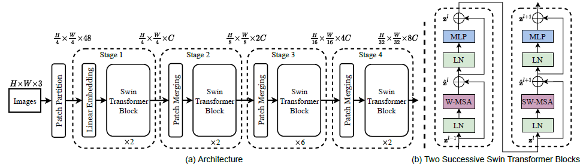

# SwinTransformer

## Overview
This project aims to replicate the architecture proposed in the Swin Transformer paper for medical image semantic segmentation. Swin Transformer is a novel architecture introduced in the paper "Swin Transformer: Hierarchical Vision Transformer using Shifted Windows" by Ze Liu et al. The Swin Transformer has shown promising results in various computer vision tasks, including image classification and object detection. In this project, we adapt the Swin Transformer architecture for the task of medical image semantic segmentation.

## Project Goals
1. **Replicate Swin Transformer Architecture**: Implement the Swin Transformer architecture described in the paper, including shifted window self-attention mechanism, patch merging, and alternating encoder blocks.
2. **Dataset Preparation**: Gather or generate a suitable dataset of medical images annotated with semantic segmentation masks. Preprocess the dataset to prepare it for training.
3. **Model Training**: Train the Swin Transformer model on the medical image dataset for semantic segmentation.
4. **Evaluation**: Evaluate the trained model on a separate validation set to assess its performance in terms of accuracy, precision, recall, and other relevant metrics.
5. **Model Modification**: Modify the Swin Transformer architecture as needed to better suit the requirements of medical image semantic segmentation.
6. **Hyperparameter Tuning**: Experiment with different hyperparameters to optimize the model's performance.
7. **Documentation**: Provide detailed documentation, including a README file, to explain the project, its objectives, implementation details, and usage instructions.

## Implementation Details
- **Architecture**: The Swin Transformer architecture consists of hierarchical vision transformer blocks using shifted windows for self-attention. These blocks are stacked to form the backbone of the model. The original Swin Transformer architecture is modified to handle the semantic segmentation task.
- **Dataset**: A dataset of medical images with corresponding segmentation masks is required for training and evaluation. The dataset should be preprocessed, including resizing, normalization, and splitting into training and validation sets.
- **Training**: The model is trained using the training dataset, and training progress is monitored using appropriate metrics such as loss and accuracy.
- **Evaluation**: The trained model is evaluated on the validation set to assess its performance. Evaluation metrics such as Intersection over Union (IoU), Dice coefficient, and pixel accuracy are computed.
- **Model Modification**: The Swin Transformer architecture may need to be modified to better suit the requirements of medical image segmentation. This could include changes in patch size, number of layers, or other architectural adjustments.
- **Hyperparameter Tuning**: Hyperparameters such as learning rate, batch size, and optimizer choice are tuned to optimize the model's performance.
- **Documentation**: Detailed documentation is provided, including a README file that explains the project, its objectives, implementation details, and usage instructions. This README serves as a guide for other researchers and developers interested in replicating or extending the project.

## Dependencies
- Python 3.x
- PyTorch
- TorchVision
- NumPy
- Matplotlib
- Other necessary libraries

## Usage
1. Clone the repository from GitHub.
2. Install the required dependencies using `pip install -r requirements.txt`.
3. Prepare the dataset for training and validation.
4. Train the Swin Transformer model using the provided script.
5. Evaluate the trained model on the validation set.
6. Modify the model architecture as needed for better performance.
7. Experiment with hyperparameters to optimize the model's performance.
8. Document the findings and results in the README file.

## References
- Swin Transformer Paper: [Swin Transformer: Hierarchical Vision Transformer using Shifted Windows](https://arxiv.org/abs/2103.14030)
- PyTorch Documentation: [https://pytorch.org/docs/stable/index.html](https://pytorch.org/docs/stable/index.html)
- TorchVision Documentation: [https://pytorch.org/vision/stable/index.html](https://pytorch.org/vision/stable/index.html)
- NumPy Documentation: [https://numpy.org/doc/stable/](https://numpy.org/doc/stable/)
- Matplotlib Documentation: [https://matplotlib.org/stable/contents.html](https://matplotlib.org/stable/contents.html)

## Contributors
- [Shreyas Dixit]

